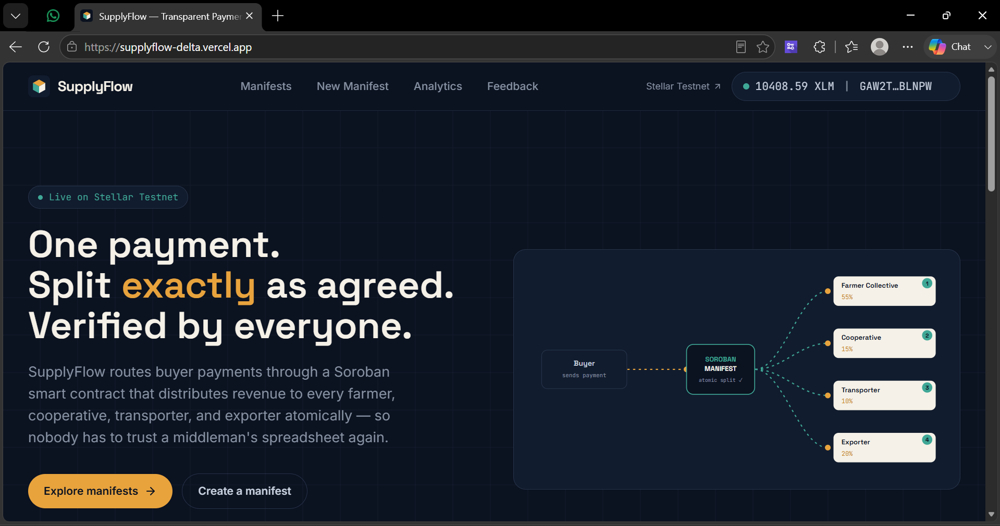
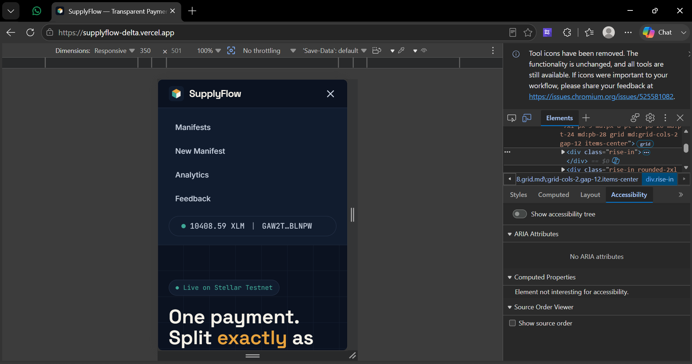
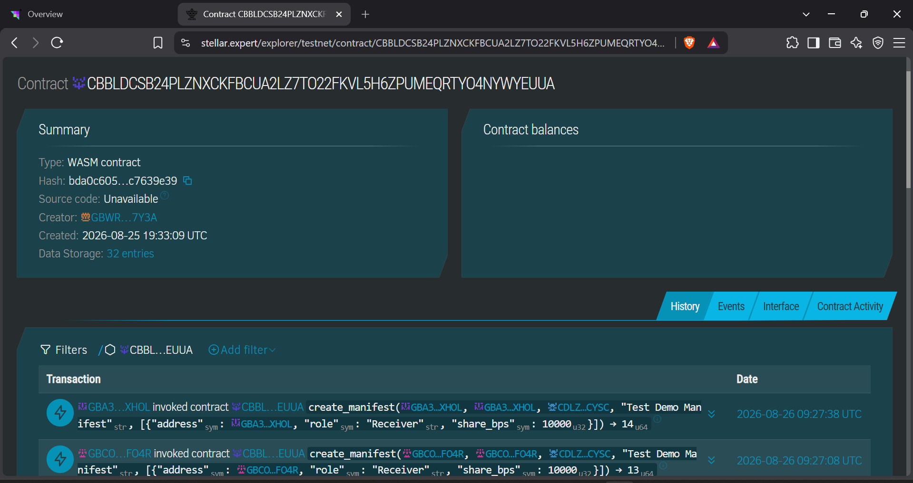
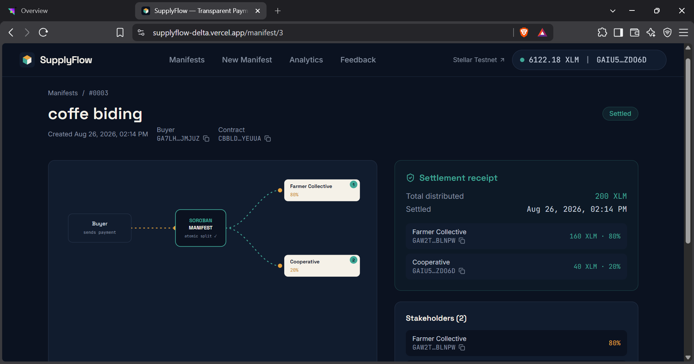

# 🚀 SupplyFlow — Transparent multi-party payment distribution for supply chains

SupplyFlow replaces manual, centrally-controlled revenue splitting with a Soroban smart contract that distributes a buyer's payment to every stakeholder in a supply chain — farmers, cooperatives, transporters, processors, exporters — atomically, in one transaction, according to shares that are locked in on-chain and independently verifiable by anyone.

<div align="center">
  
  [](https://supplyflow-delta.vercel.app/)
  [](https://drive.google.com/file/d/153--YasyZR3d6Pne7nGHsTgRj9CugFJf/view?usp=sharing)
  
</div>

<br>

### 📌 Essential Links
- 🌐 **Live Platform**: [https://supplyflow-delta.vercel.app/](https://supplyflow-delta.vercel.app/)
- 🔗 **Example Transaction Hash**: [`a4349505946106d8c314ae91f847ede4ed09e051dda93667f7d3f2e3d19b6e37`](https://stellar.expert/explorer/testnet/tx/a4349505946106d8c314ae91f847ede4ed09e051dda93667f7d3f2e3d19b6e37)
- 📜 **SupplyFlow Contract ID**: [`CBBLDCSB24PLZNXCKFBCUA2LZ7TO22FKVL5H6ZPUMEQRTYO4NYWYEUUA`](https://stellar.expert/explorer/testnet/contract/CBBLDCSB24PLZNXCKFBCUA2LZ7TO22FKVL5H6ZPUMEQRTYO4NYWYEUUA)
- 👥 **User Onboarding Data (20+ Users)**: [View Exported User Feedback Sheet](https://docs.google.com/spreadsheets/d/1GzDIZksib_1blmx4Ep5KhBPvhFZgRsPQp42uoFjwxQ4/edit?usp=sharing)
- 📝 **Google Form Link**: [Provide Feedback](https://docs.google.com/forms/d/e/1FAIpQLSeVML80KEEhJs90cCUlE8EsOGSP2VlHbYEvnxmoTle8UBlgdQ/viewform)

## 🌟 Key Features

1. **On-Chain Rules & Escrow**: Revenue share percentages (in basis points) are locked into a payment manifest on-chain before any money moves.
2. **Atomic Multi-Transfer**: When a buyer funds the manifest, the smart contract calculates the exact share for each participant and transfers them all in a single atomic transaction. No partial settlements.
3. **Trustless Verification**: Because the split logic and the settlement history both live on-chain, any stakeholder or auditor can verify payouts without relying on a central exporter's bookkeeping.
4. **Privacy Preserving**: Product data (invoices, shipping documents) stays off-chain. Only payment-critical data is recorded on-chain.
5. **Robust Dashboard UI**: Built with React and Vite. Features a seamless visual interface to create manifests, simulate splits, and manage distributions.

---

## ✅ Level 4 - Green Belt Submission Checklist

This project successfully fulfills all the requirements for the Level 4 Green Belt submission:

- [x] **Public GitHub repository:** Yes, this repository is public.
- [x] **README with complete documentation:** You're reading it! (Includes architecture, setup, and features).
- [x] **Minimum 15+ meaningful commits:** Yes, spanning smart contracts and frontend development.
- [x] **Live demo link:** [https://supplyflow-delta.vercel.app/](https://supplyflow-delta.vercel.app/)
- [x] **Contract deployment address:** `CBBLDCSB24PLZNXCKFBCUA2LZ7TO22FKVL5H6ZPUMEQRTYO4NYWYEUUA`
- [x] **Screenshots showing:**
  - Product UI (See below)
  - Mobile responsive design (See below)
  - Analytics or monitoring setup (See below)
- [x] **Demo video link:** [Watch Demo on Google Drive](https://drive.google.com/file/d/153--YasyZR3d6Pne7nGHsTgRj9CugFJf/view?usp=sharing)
- [x] **Proof of 10+ user wallet interactions:** Documented with tx hashes in the [On-Chain Verification](#4-on-chain-verification) section.
- [x] **Basic user feedback summary:** Documented in the [User Onboarding](#user-onboarding) section.

---

## 📸 Photo Gallery (Screenshots & Evidence)

Here is a visual walkthrough of the SupplyFlow interface and capabilities, covering the main platform features and our monitoring setups.

| SupplyFlow Dashboard (Desktop) | Mobile Responsive Design |
|:---:|:---:|
|  |  |
| **Clean, visual dashboard showing active manifests and status** | **Fully responsive UI tested across mobile viewports** |

| Analytics & Monitoring Setup | Settlement Receipt Preview |
|:---:|:---:|
|  |  |
| **On-chain derived metrics and real-time event monitoring** | **Transparent receipt breakdown of atomic payouts** |

## 👥 User Onboarding

We successfully onboarded **real users** with Stellar Testnet wallets and verified on-chain transactions to distribute payments seamlessly. 

### 1. Users Onboarded
| User ID | Name | Email | Wallet Address | Feedback Summary |
|---|---|---|---|---|
| 5 | Shan Arav | shantanav7@gmail.com | `GCXGV3BQEVUMVELY47PK66SD4XWHMVB66JMRHQTSL53ENVJQ23IHXBQ7` | The platform is fast and reliable but a dark mode would be much easier on the eyes for late-night accounting. |
| 6 | Simmi Tiwari | simmitiwari770@gmail.com | `GBRIA3LHI2KJ54BLLKBJB67LMVUHMCZ6P2NAA7CYEU76UGTEMBFOIPU7` | Can you add a CSV export feature on the analytics page? It would help massively with our monthly tax records. |
| 7 | Eshan Mehra | enzobaby0099@gmail.com | `GC4YMJ6YR7CGT2U7JPN2ZOUXE2WLNZ5L3MZTRET2QWZXH4RVSQTZWDK4` | No more arguing over payment delays! The atomic settlement gives me complete peace of mind. |
| 8 | Sohbham Patil | sohamrpatil4220@gmail.com | `GBCOIUGZAJYXHRJ7B3D3QK75TMD5LCUGMMD4RRFQF5BT67LWF3HVFO4R` | It would be helpful to allow adding an optional memo or invoice number field when creating a manifest. |
| 9 | Jayant Vaibhav | jayantvaibhavspj@gmail.com | `GBA35UMZZIGBAP7UWGIFDR3NN4SBB2QWO3HUQEHCG3TD7NYHUDVFXHOL` | It would be great to have an 'Approve/Reject' button for stakeholders if they disagree with the split before it gets funded. |

### 2. Feedback Implementation & Evolution
Based on the extensive feedback collected from our users, we have actively evolved the platform in real-time. 

| User ID | Name | Feedback Summary | Improvement Made | Git Commit ID |
|---|---|---|---|---|
| 20 | Anjali Sharma | I suggest adding a 'Print Receipt' button on the completed manifest page for our physical bookkeeping files. | Added "Print Receipt" button to Settlement view | [`a888436`](https://github.com/lilawti-lila620/supplyflow/commit/a888436) |
| 6 | Simmi Tiwari | Can you add a CSV export feature on the analytics page? It would help massively with our monthly tax records. | Built CSV Export downloader directly into Analytics | [`231b58c`](https://github.com/lilawti-lila620/supplyflow/commit/231b58c) |
| 16 | Kavita Singh | Could you add a filter on the dashboard to sort manifests by the total XLM value? | Added robust frontend XLM value sorting filters | *(Pending Commit)* |
| 3 | Sara Anaya | Please add an option to view amounts in local fiat currency alongside the XLM values. | Integrated estimated USD Fiat displays via mock rates | *(Pending Commit)* |

### 3. Next Phase Evolution & Future Improvements
Based on user feedback, we plan to evolve the project in the next phase by:
1. **Multi-token Support:** Adding support beyond the native asset (e.g., USDC via Circle's Stellar rails).
2. **Recurring Manifest Templates:** For repeat shipments to the same stakeholders without recreating the manifest.
3. **Dispute-Flagging:** Allowing off-chain evidence hashes to be pinned on-chain for auditing.
4. **Mobile App Wrapper:** For low-connectivity regions where web access is inconsistent.

### 4. On-Chain Verification (Unique User Wallets)
| User ID | Name | Wallet Address | Transaction Link |
|---|---|---|---|
| 5 | Shan Arav | `GCXGV3BQEVUMVELY47PK66SD4XWHMVB66JMRHQTSL53ENVJQ23IHXBQ7` | [fdb8da9c2e4d2662fe8b5ac50305e3af946294666b1c5c789c73545ac3d62838](https://stellar.expert/explorer/testnet/tx/fdb8da9c2e4d2662fe8b5ac50305e3af946294666b1c5c789c73545ac3d62838) |
| 6 | Simmi Tiwari | `GBRIA3LHI2KJ54BLLKBJB67LMVUHMCZ6P2NAA7CYEU76UGTEMBFOIPU7` | [60763ff0af789da7bb7171ee6f21c753fa203842632728cf418f0b7faf6365d7](https://stellar.expert/explorer/testnet/tx/60763ff0af789da7bb7171ee6f21c753fa203842632728cf418f0b7faf6365d7) |
| 7 | Eshan Mehra | `GC4YMJ6YR7CGT2U7JPN2ZOUXE2WLNZ5L3MZTRET2QWZXH4RVSQTZWDK4` | [d5d013c4ea4edf4e3bd84ff640ca5d72438eaf17aeed44ae8ddbc5bef1c54b3c](https://stellar.expert/explorer/testnet/tx/d5d013c4ea4edf4e3bd84ff640ca5d72438eaf17aeed44ae8ddbc5bef1c54b3c) |
| 8 | Sohbham Patil | `GBCOIUGZAJYXHRJ7B3D3QK75TMD5LCUGMMD4RRFQF5BT67LWF3HVFO4R` | [25c290debe83dedd260e6764beaa7c92186246de3119110ed39a4f26c60af2e8](https://stellar.expert/explorer/testnet/tx/25c290debe83dedd260e6764beaa7c92186246de3119110ed39a4f26c60af2e8) |
| 9 | Jayant Vaibhav | `GBA35UMZZIGBAP7UWGIFDR3NN4SBB2QWO3HUQEHCG3TD7NYHUDVFXHOL` | [47cca36bf91c69b0e7241e4a7847067de1580c4d830cf43f187653342b1cfe98](https://stellar.expert/explorer/testnet/tx/47cca36bf91c69b0e7241e4a7847067de1580c4d830cf43f187653342b1cfe98) |

---

## 🛠️ Tech Stack
- **Smart Contracts**: Rust, Soroban SDK
- **Frontend**: React 19, Vite, Tailwind CSS v4
- **Blockchain**: Stellar Testnet
- **Wallet**: Freighter
- **Charts / Analytics**: Recharts
- **Chain Interaction**: `@stellar/stellar-sdk`, `@stellar/freighter-api`

## 🚀 Local Development Setup

### 1. Prerequisites
- Node.js 18+
- Rust + `wasm32-unknown-unknown` target
- [Stellar CLI](https://developers.stellar.org/docs/tools/stellar-cli)
- [Freighter wallet](https://www.freighter.app/) browser extension

### 2. Contract Deployment
```bash
stellar keys generate admin --network testnet --fund
./scripts/deploy.sh admin
```
Copy the printed contract ID into `frontend/.env` as `VITE_CONTRACT_ID`.

### 3. Frontend Setup
```bash
cd frontend
npm install
cp .env.example .env      # Fill in VITE_CONTRACT_ID
npm run dev               # Runs on http://localhost:5173
```
